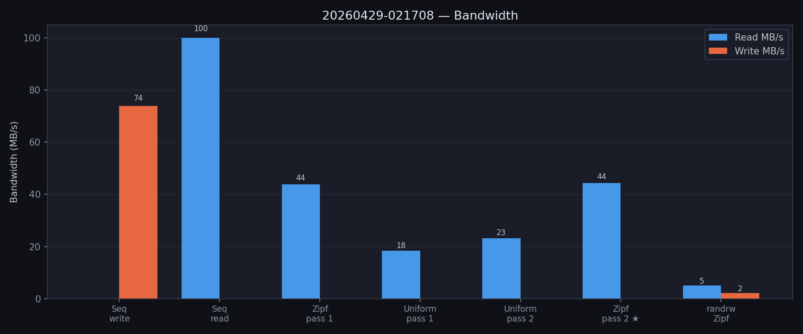
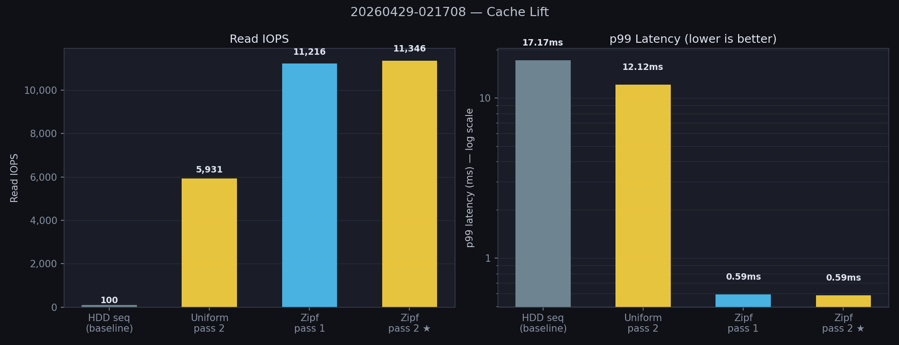
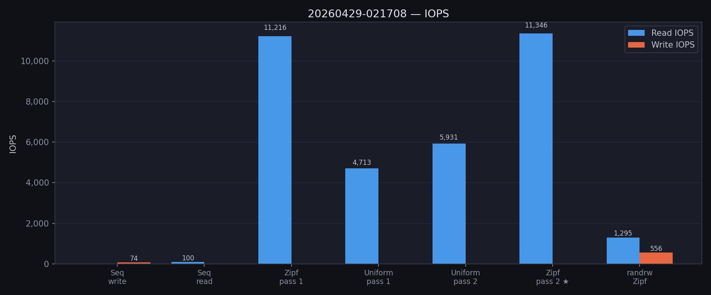
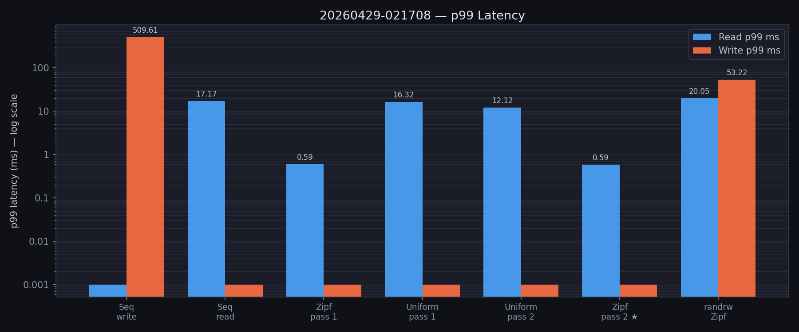
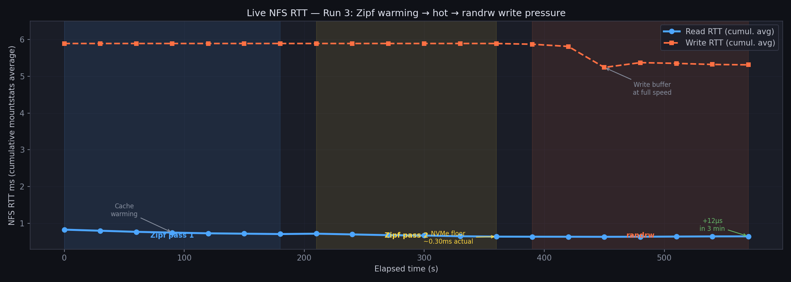
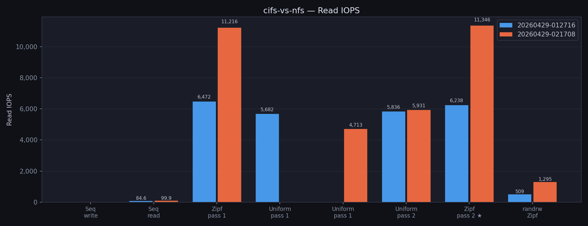
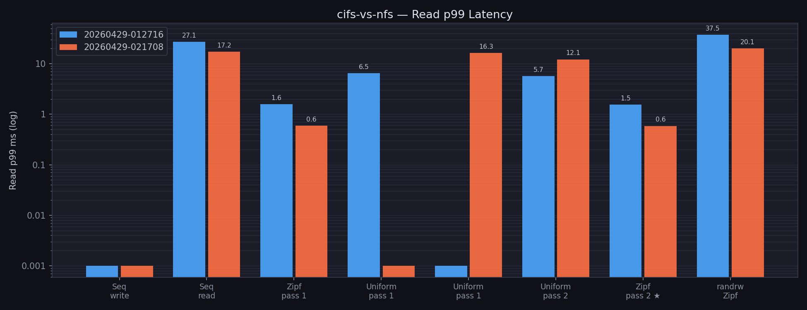

# bench-nas

fio-based NAS performance benchmark suite for NFS and CIFS mounts.
Designed specifically to reveal the NVMe cache tier effect on a
**UniFi UNAS Pro 4** with 5900 RPM HDD RAID 1 and 2 TB NVMe RAID 1 cache.

## Hardware context

| Component | Detail |
|-----------|--------|
| NAS | UniFi UNAS Pro 4 |
| HDDs | 5900 RPM, RAID 1 |
| NVMe cache | 2× 2 TB NVMe in RAID 1 = **2 TB effective** |
| Cache policy | **Random IO only** — sequential IO bypasses NVMe entirely |
| Cache mode | **Read-write (write-back)** |
| Link | 10 GbE SFP+ direct to client (no switch) |

This cache policy is critical to understand: sequential benchmarks measure
raw HDD+network performance regardless of cache state. Only random IO
benefits from the NVMe cache.

## What each test measures

| ID | Test | What it tells you |
|----|------|------------------|
| A | Sequential write | HDD RAID write speed over network — **cache bypassed** |
| B | Sequential read | HDD RAID read speed over network — **cache bypassed** |
| C | Uniform rand read pass 1 | First-touch random IO; demand-caching begins |
| D | Uniform rand read pass 2 | Same file again; demand-cached warm baseline |
| E | Zipf rand read pass 1 | Hot-set warming (θ=1.2); cache fills with hot blocks |
| F | Zipf rand read pass 2 | **Definitive cache measurement** — hot-set fully resident |
| G | Mixed Zipf randrw 70/30 | Write pressure effect on cached reads (separate file) |

**Tests E→F are the primary signal.** The Zipf distribution (θ=1.2) models
real-world locality: ~20% of blocks receive ~80% of accesses. Pass 1 warms
the NVMe cache; pass 2 measures fully-cached performance. The gap between
pass 1 and pass 2 is the cache effect.

### Why sequential tests do not show cache benefit

The UNAS Pro 4 caches only random IO by policy. Sequential reads and writes
go straight to the HDD RAID mirrors regardless of cache state. The NVMe
cache cannot help sequential workloads, and the bottleneck is HDD throughput
+ network stack (not the NVMe drives). This is expected and correct behavior.

### Why uniform random cold/hot is unreliable without a cache flush

The cache is 2 TB. The test file is 128 GB (6% of cache capacity). Without
rebooting the NAS, the cache may already contain portions of the test file
from prior activity — making "cold" reads not truly cold. Tests C/D measure
**demand-caching behaviour** (first-touch vs already-touched), not a
guaranteed cold vs warm comparison.

For a true cold baseline: reboot the NAS, then run immediately. Alternatively,
use `--size` larger than the cache capacity (>2T).

### Why randrw uses a separate file

Test G writes to `cache-randrw.bin`, not `cache-test.bin`. This preserves
the read test's block pattern in the NVMe cache so the write pressure
measurement is clean — if both tests used the same file, G's writes would
corrupt E/F's cached data, making the comparison meaningless.

## Prerequisites

```bash
sudo apt update && sudo apt install -y fio
```

```bash
# Install uv if not present
curl -LsSf https://astral.sh/uv/install.sh | sh
uv sync
```

## Running

```bash
# Standard run — NFS (recommended)
uv run run_nas_bench.py --label nfs

# Quick validation (30s/60s runtimes)
uv run run_nas_bench.py --quick --label nfs-quick

# CIFS run for comparison — mount CIFS first, then:
uv run run_nas_bench.py --mount ~/nas-cifs --label cifs

# Larger file or longer runtime
uv run run_nas_bench.py --size 256G --runtime 180 --label nfs-256g

# Skip file preparation if test files already exist
uv run run_nas_bench.py --skip-prepare --label nfs

# Re-parse a previous results directory
uv run parse_fio_results.py results/20260429-015508-nfs/

# Generate plots from a results directory
uv run plot_results.py results/20260429-015508-nfs/ --out-dir docs/plots
```

### All options

```
--mount         NAS mount point (default: ~/nas)
--bench-dir     Benchmark directory (default: <mount>/bench)
--size          Test file size (default: 128G)
--runtime       Sequential/uniform test duration in seconds (default: 120)
--zipf-runtime  Zipf test duration (default: runtime+60)
--jobs          fio numjobs (default: 4)
--iodepth       fio iodepth (default: 32)
--label         Tag for result dir name, e.g. 'nfs' or 'cifs' (default: fstype)
--skip-prepare  Skip test file creation
--quick         30s/60s runtimes for quick validation
--cleanup       Delete benchmark files after run
--results-dir   Override results output directory entirely
```

### For a definitive CIFS vs NFS comparison

```bash
# 1. Mount both protocols
sudo mount -t nfs  ... ~/nas-nfs
sudo mount -t cifs ... ~/nas-cifs

# 2. Run the suite for each
uv run run_nas_bench.py --mount ~/nas-nfs  --skip-prepare --label nfs
uv run run_nas_bench.py --mount ~/nas-cifs --skip-prepare --label cifs

# 3. Compare Zipf pass 2 p99 and IOPS between:
#    results/TIMESTAMP-nfs/summary.txt
#    results/TIMESTAMP-cifs/summary.txt

# 4. Generate side-by-side comparison plots
uv run plot_results.py results/TIMESTAMP-nfs results/TIMESTAMP-cifs \
    --label cifs-vs-nfs --out-dir docs/plots
```

## Interpreting results

### Sequential MB/s (tests A/B)
Reflects network link speed + HDD RAID throughput. On 10 GbE expect up to
~1,250 MB/s theoretical; in practice limited by HDD RAID (~100–200 MB/s for
5900 RPM RAID 1). The NVMe cache has no effect here.



### Uniform random IOPS (tests C/D)
Shows demand-caching: blocks accessed in pass 1 get cached into NVMe, so pass
2 is faster. The improvement depends on how much of the working set fit in
cache during pass 1. For a file much smaller than cache capacity (128G vs 2TB),
both passes will show good numbers after the first run; meaningful cold results
require a cache flush.

### Zipf IOPS and p99 latency (tests E/F) — the key numbers
- **Pass 1**: cache warming; mix of HDD misses and NVMe hits
- **Pass 2**: hot set fully cached; every IO hits NVMe
- **Pass 2 p99** is the definitive NVMe cache latency for your setup
- **Pass 2 / pass 1 IOPS ratio**: cache warming multiplier
- **Pass 2 p99 vs HDD baseline**: total cache benefit over raw disks

Observed on UNAS Pro 4 over NFS v3 / 10 GbE:
- Pass 2: **~11,000 IOPS**, **0.59ms p99**
- HDD baseline: ~100 IOPS, ~10ms latency
- Cache lift: **~110× IOPS, ~17× p99 latency improvement**







### Mixed randrw (test G)
Shows whether 30% write traffic evicts cached read blocks. If read IOPS drops
significantly vs test F, the write working set is competing for cache space.
On UNAS Pro 4 with 2TB cache and 64G randrw file, read RTT barely changed
(0.635ms → 0.647ms over 3 minutes), indicating no meaningful cache eviction.

### NFS RTT floor
At full NVMe cache hit rate, the remaining latency (~0.30–0.35ms) is NFS v3
protocol overhead — RPC serialization + TCP stack. This is the irreducible
floor for NFS v3 over 10 GbE regardless of storage speed.

The chart below shows the live NFS RTT measured every 30s via `mountstats`
during run 3 — cache warming in pass 1, stabilising at NVMe floor in pass 2,
and the negligible +12µs read RTT rise under 3 minutes of write pressure.



## NFS vs CIFS

NFS v3 is the recommended protocol for Linux clients on 10 GbE:

| Factor | CIFS/SMB3 | NFS v3 |
|--------|-----------|--------|
| Per-op overhead | High | Low |
| Parallel TCP connections | No equivalent | `nconnect=8` |
| Metadata ops | Always validates on open | `nocto` skips it |
| Observed Zipf p99 | ~1.55ms | **0.59ms** |
| Observed Zipf IOPS | ~6,200 | **~11,000** |





Recommended NFS mount options (in `/etc/fstab`):
```
<export> <mountpoint> nfs vers=3,rsize=1048576,wsize=1048576,
    noatime,nordirplus,nconnect=8,nocto,proto=tcp,
    nofail,x-systemd.automount,_netdev  0 0
```

## Output

Results land in `results/YYYYMMDD-HHMMSS-<label>/`:

```
results/
  20260429-015508-nfs/
    sysinfo.txt              hostname, uname, lsblk, df, findmnt, ethtool
    seqwrite-control.json
    seqread-control.json
    randread-uniform-1.json
    randread-uniform-2.json
    zipf-randread-1.json
    zipf-randread-2.json     ← definitive cache result
    randrw-zipf.json
    summary.txt              ASCII table + key comparisons
    summary.csv              machine-readable
    plot_*.png               charts (if plot_results.py was run)
```

## Warnings

- Verify the mount: the suite checks `findmnt` and warns on unexpected fstype.
- Large files: 128G test + 64G randrw = **192G** of NAS storage used.
- Write tests overwrite benchmark files. Do not point `--bench-dir` at important data.
- `--cleanup` removes the binary files after the run.
- True cold baseline requires rebooting the NAS before running.
